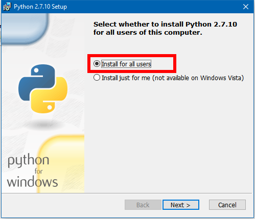
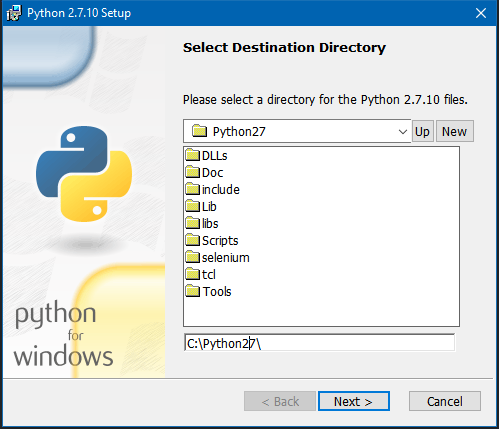
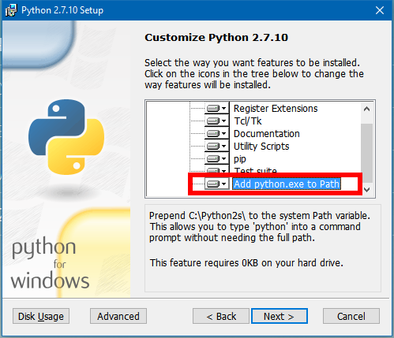

# Python范例

## 1. 安装Python
1) 安装文件为: `/packages/python-2.7.10.msi`

2) 注意:

* 第一步要选择为所有用户安装 `Install for all users`

 

* 第二步路径默认即可



* 第三步一定要 `Add python.exe to Path`, 选择 `Entire feature will be installed on local hard drive`



## 2. 操作MySQL
1) 安装Python连接MySQL的包 `/packages/MySQL-python-1.2.4b4.win32-py2.7.exe`

2) 在MySQL中创建一个测试数据库

```sql
CREATE DATABASE IF NOT EXISTS test_py;
USE test_py;
DROP TABLE IF EXISTS person;
CREATE TABLE person(
    id INT AUTO_INCREMENT PRIMARY KEY,
    name VARCHAR(50),
    age INT,
    gender VARCHAR(10)
    );
```

3) 使用方法：

* 在代码中引入MyDB.py

```python
from MyDB import MyDB
```
> 注意将MyDB.py放在当前目录下, 最新版MyDB.py [点此下载](https://github.com/yqji/my-python-packages/tree/master/packages)

* 创建数据库对象

```python
MyDB(user=USER, passwd=PASSWD, db=DB, host='127.0.0.1', port=3306, charset='UTF8')

```
> 其中: USER, PASSWD, DB 分别为自己数据库的用户名, 密码, 以及要连接的数据库.

> host, port, charset是具有默认值的[默认参数](http://www.liaoxuefeng.com/wiki/001374738125095c955c1e6d8bb493182103fac9270762a000/001374738449338c8a122a7f2e047899fc162f4a7205ea3000), 本地调试时一般不需要指定.

* MyDB包基于MySQLdb包, 提供基本的数据库 **CRUD(增查改删)** 操作.

(a) **Create**. 一般用于插入一条或多条数据库记录, MyDB提供 ***insert*** 方法来实现, 并返回**首个插入行的ID**.

```python
MyDB.insert(table_name, params, field_list=[], is_many=False, is_ignore=False)
```
> 使用 ***insert*** 方法必须指定**目标数据表名**, **待插入的值**, 可以选择以[list](http://www.liaoxuefeng.com/wiki/001374738125095c955c1e6d8bb493182103fac9270762a000/001386819318453af120e8751ea4d2696d8a1ffa5ffdfd7000)形式指定**插入的列名**.

> ***is_many*** 参数用于指定插入的方式是**单条插入**或**批量插入**, 默认**单条插入**.

> ***is_ignore*** 参数用于指定插入时遇到键值重复的记录是是否选择**忽略**, 默认**不忽略**.

(b) **Retrieve**. 一般用于查询符合条件的记录, MyDB提供 ***select*** 方法来实现, 并以[tuple](http://www.liaoxuefeng.com/wiki/001374738125095c955c1e6d8bb493182103fac9270762a000/001386819318453af120e8751ea4d2696d8a1ffa5ffdfd7000)形式返回**结果集**.

```python
MyDB.select(sql)
```
> 使用 ***select*** 方法只须指定**SQL语句**即可.

(c) **Update**. 一般用于更新符合条件的记录, MyDB提供 ***update*** 方法来实现, 并返回**更新行数**.

```python
MySQL.update(sql, params, is_many=False)
```
> 使用 ***update*** 方法须指定**带有占位符的SQL语句**, **待更新的值**.

> ***is_ignore*** 参数用于指定更新时遇到键值重复的记录是是否选择**忽略**, 默认**不忽略**.


(d) **Delete**. 一般用于删除指定的记录, MyDB提供 ***delete*** 方法来实现, 并返回**删除行数**.

```python
MyDB.delete(sql)
```
> 使用 ***delete*** 方法只须指定**SQL语句**即可.

(e) **其它**. 由于水平有限, 无法考虑到所有情况, 故提供 ***execute_sql*** 方法来实现执行任意SQL语句的功能.

```python
MyDB.execute_sql(sql)
```
> 使用 ***execute_sql*** 方法只须指定**SQL语句**即可.


* 示例

> 以下示例基于2)中创建的示例数据库`test_py`和数据表`person`

```python
# !usr/bin/env python
# coding: utf-8

from __future__ import unicode_literals, print_function

from MyDB import MyDB

__author__ = 'David Ji'

'''MyDB Example'''


def main():
    # 创建数据库实例(注意修改此处用户名和密码等)
    test_db = MyDB(user='root', passwd='****', db='test_py')

    # Create
    c_params = (('Benzema', 28, 'M'), ('Bale', 26, 'M'), ('Ronaldo', 31, 'M'))
    last_row_id = test_db.insert('person', c_params,
                                 field_list=['name', 'age', 'gender'],
                                 is_many=True)
    print(last_row_id)  # 1

    # Retrieve
    result_set = test_db.select('SELECT * FROM person;')   
    print(result_set) # (1L, u'Benzema', 28L, u'M'), (2L, u'Bale', 26L, u'M'), (3L, u'Ronaldo', 31L, u'M'))

    # Update
    update_sql = 'UPDATE person SET age=%s WHERE name=%s;'
    u_params = (29, 'Benzema')
    update_rows_cnt = test_db.update(update_sql, u_params)
    print(update_rows_cnt)  # 1

    # Delete
    delete_rows_cnt = test_db.delete("DELETE FROM person WHERE age>30;")
    print(delete_rows_cnt)  # 1


if __name__ == '__main__':
    main()

```
## 3. 调用机器学习算法
1) 依次安装如下python包:

* numpy
    
    `pip install numpy.whl`

* scipy
    
    `pip install scipy.whl`
    
* pandas
    
    `pip install pandas.whl`
    
* scikit-learn
    
    `pip install scikit_leran.whl`

> 以上命令须在命令行中将路径 cd 到 ***packages*** 目录下执行.

2) **scikit-learn**是一个很强大的机器学习包, 提供了**分类**, **回归**, **聚类**, **降维**, **模型选择**, **数据预处理**等多种操作的Python实现.

> 具体说明可见[官网](http://scikit-learn.org/stable/index.html).

3) 以下是**随机森林**分类算法的介绍

* 初始化分类器

```python
clf = RandomForestClassifier(n_estimators=10, criterion='gini', max_depth=None, min_samples_split=2, min_samples_leaf=1, min_weight_fraction_leaf=0.0, max_features='auto', max_leaf_nodes=None, bootstrap=True, oob_score=False, n_jobs=1, random_state=None, verbose=0, warm_start=False, class_weight=None)
```
> 具体参数介绍在[此处](http://scikit-learn.org/stable/modules/generated/sklearn.ensemble.RandomForestClassifier.html#sklearn.ensemble.RandomForestClassifier)

* 训练分类器

```python
clf.fit(X, y)
```
> X, y 分别为特征训练集和类别训练集

* 测试分类器

```python
clf.predit(X)
clf.predit_proba(X)
```
> X为特征测试集, 返回预测的分类类别, 或各类别概率

* 示例

> 以下示例基于 ***scikit-learn***

```python
# !usr/bin/env python
# coding: utf-8

from __future__ import unicode_literals, print_function

import pandas as pd
from sklearn.datasets import load_iris
from sklearn.ensemble import RandomForestClassifier
from sklearn.cross_validation import train_test_split
from sklearn.metrics import classification_report

__author__ = 'David Ji'

'''Random Forest Example'''


def main():
    # Load data
    # iris是一个数据集字典, 有如下key: 
    # 'target_names', iris类别名称: 'setosa' 'versicolor' 'virginica'
    # 'data', iris的特征数据
    # 'target', iris的类别数据
    # 'DESCR', 数据集描述
    # 'feature_names', 特征名称: 'sepal length (cm)', 'sepal width (cm)', 'petal length (cm)', 'petal width (cm)'
    iris = load_iris()

    # iris['data']是一个150*4 numpy多维数组, 是iris的特征数据
    
    X = iris['data']
    
    # iris['target']是一个150*1 numpy数组, 是iris的类别数据, 与iris['data']一一对应
    y = iris['target']

    # 划分训练集, 测试集
    X_train, X_test, y_train, y_test = train_test_split(
        X, y, random_state=None, train_size=0.6)

    # 初始化分类器
    clf = RandomForestClassifier(
        n_estimators=20, criterion='entropy', max_features='auto',
        max_depth=None, bootstrap='True', n_jobs=-1)

    # 训练分类器
    clf.fit(X_train, y_train)

    # 测试分类器
    preds = clf.predict(X_test)

    # 输出测试报告
    tab = pd.crosstab(
        y_test, preds, rownames=['actual'], colnames=['predictions'])
    report = classification_report(y_test, preds)
    print(tab)
    print(report)

    # predictions   0   1   2
    # actual
    # 0            21   0   0
    # 1             0  19   1
    # 2             0   0  19
    #              precision    recall  f1-score   support

    #           0       1.00      1.00      1.00        21
    #           1       1.00      0.95      0.97        20
    #           2       0.95      1.00      0.97        19

    # avg / total       0.98      0.98      0.98        60


if __name__ == '__main__':
    main()

```